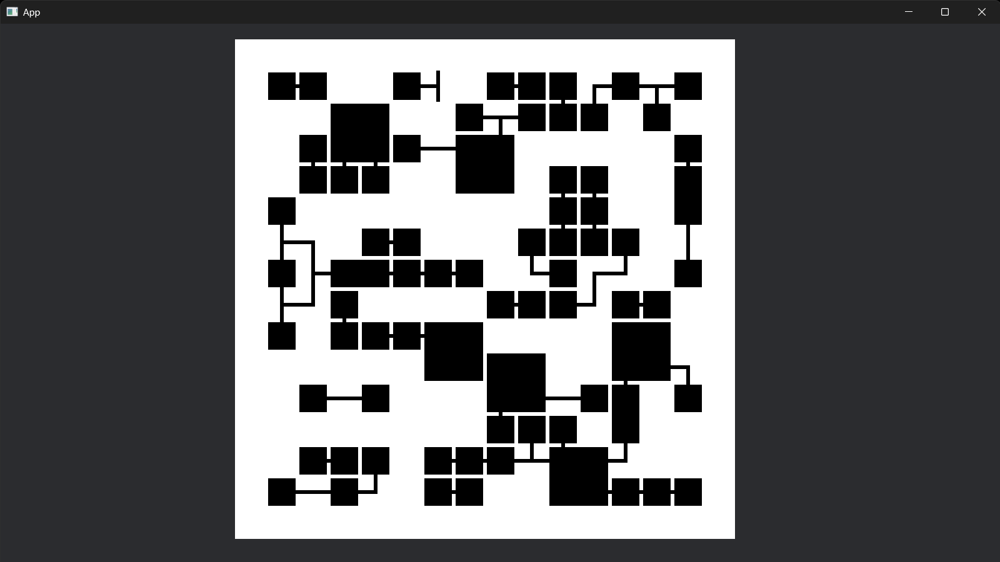
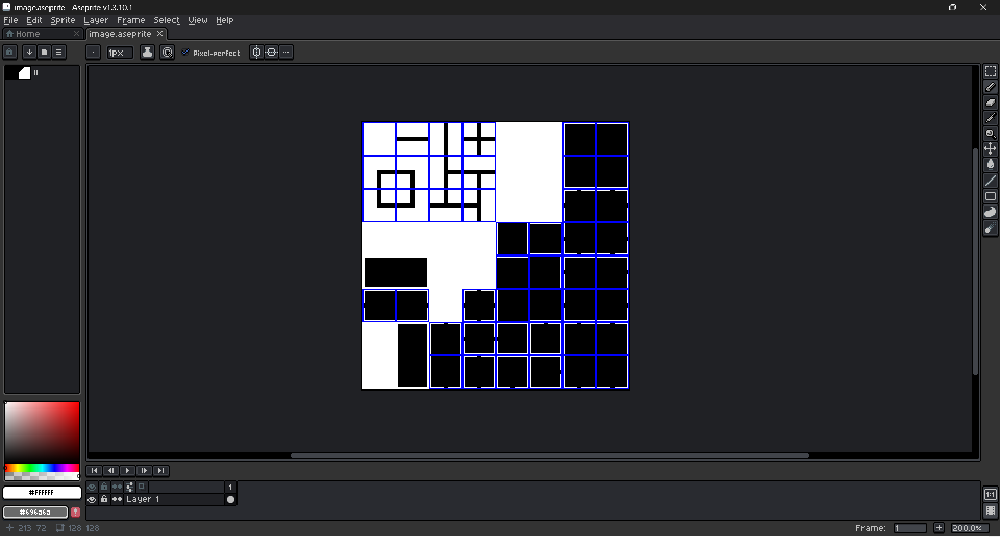

# bevy_wave_function_collapse_aseprite

Create tileset with Aseprite, run Wave Function Collapse, and display tiles with Bevy Engine.



# Usage

#### 1. Create Tileset Image with Aseprite



#### 2. Generate Tilesets from Aseprite

```rust
let tileset: Tileset = generate_tiles_from_aseprite(&aseprite, &image);
```

#### 3. Create Initial Grid

```rust
let mut grid: Grid = create_grid(&tileset, DIMENSION);
```

#### 4. Run Wave Function Collapse

```rust
let collapsed: Grid = run_wave_function_collapse(&grid, &tileset, &mut rng, DIMENSION);
```

#### 5. Display Result

```rust
for cell in collapsed.iter() {
    commands.spawn((
        AseSpriteSlice {
            aseprite: aseplite.clone(),
            name: tileset[cell.sockets[0]].slice_name.clone(),
        },
        Transform::from_translation(Vec3::new(
            (cell.index % DIMENSION) as f32 * TILE_SIZE as f32,
            (cell.index / DIMENSION) as f32 * TILE_SIZE as f32 * -1.0,
            0.0,
        )),
    ));
}
```

See examples for more details.

# Running Example

```bash
$ cargo run --example basic
```

# Credits

This project's source codes is based on the following repository:

https://github.com/webcyou-org/wave-function-collapse-rust

Article by the author(Ja):

https://qiita.com/panicdragon/items/5a02d3d1470179d77ece

See also:

https://github.com/mxgmn/WaveFunctionCollapse
